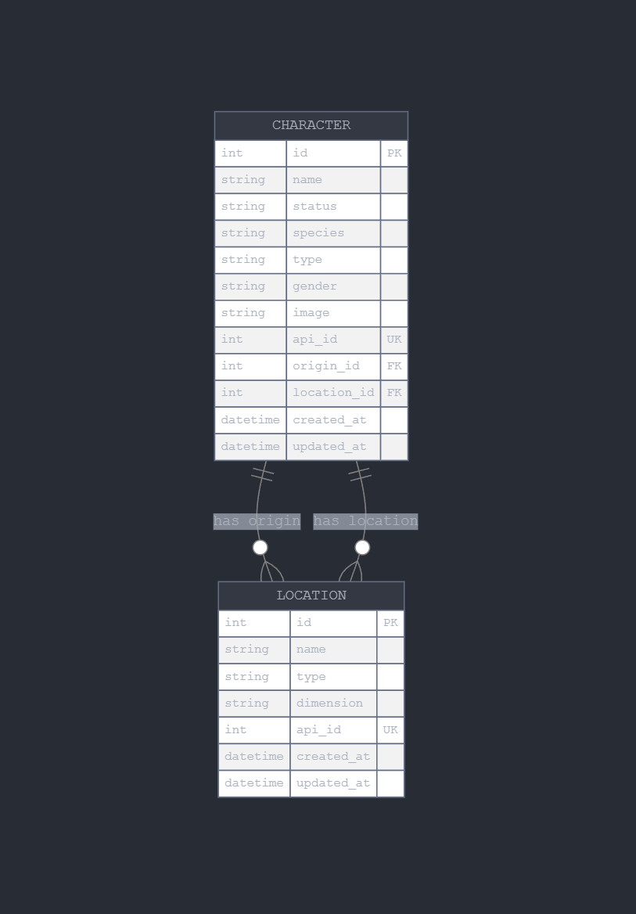

 
# Rick and Morty Character API

Una API para buscar personajes de Rick and Morty implementando GraphQL, caché con Redis y persistencia en PostgreSQL.

## Índice
- [Descripción](#descripción)
- [Estructura del Proyecto](#estructura-del-proyecto)
- [Requisitos](#requisitos)
- [Instalación](#instalación)
- [Uso](#uso)
- [Estructura de la Base de Datos](#estructura-de-la-base-de-datos)
- [Endpoints](#endpoints)
- [Ejemplos de Consultas](#ejemplos-de-consultas)
- [Pruebas](#pruebas)

## Descripción

Esta API permite realizar búsquedas de personajes de Rick and Morty, con capacidad de filtrado por nombre, estado, especie, género y origen. 

Características principales:
- API GraphQL implementada con Apollo Server y Express
- Base de datos PostgreSQL con ORM Sequelize
- Caché con Redis para mejorar el rendimiento
- Tarea CRON para actualización automática de datos
- Middleware de logging para registrar información de las peticiones
- Decorador para medir el tiempo de ejecución de consultas
- Pruebas unitarias con Jest
- Documentación con Swagger

## Estructura del Proyecto

```
.
├── src/
│   ├── config/           # Configuraciones (base de datos, swagger)
│   ├── db/               # Conexión a la base de datos
│   ├── decorators/       # Decoradores personalizados
│   ├── graphql/          # Esquemas y resolvers de GraphQL
│   ├── middleware/       # Middlewares de Express
│   ├── migrations/       # Migraciones de Sequelize
│   ├── models/           # Modelos de Sequelize
│   ├── seeders/          # Semillas de datos iniciales
│   ├── services/         # Servicios (Redis, CRON)
│   ├── utils/            # Utilidades
│   ├── __tests__/        # Pruebas unitarias
│   ├── app.ts            # Configuración de la aplicación
│   └── index.ts          # Punto de entrada de la aplicación
├── .env.example          # Ejemplo de variables de entorno
├── .eslintrc.js          # Configuración de ESLint
├── .sequelizerc          # Configuración de Sequelize CLI
├── docker-compose.yml    # Configuración de Docker Compose
├── Dockerfile            # Configuración de Docker
├── jest.config.js        # Configuración de Jest
├── package.json          # Dependencias del proyecto
├── tsconfig.json         # Configuración de TypeScript
└── README.md             # Documentación del proyecto
```

## Requisitos

- Node.js >= 14.x
- Docker y Docker Compose
- Git

## Instalación

1. Clonar el repositorio:
   ```bash
   git clone https://github.com/tu-usuario/rick-and-morty-api.git
   cd rick-and-morty-api
   ```

2. Crear archivo de variables de entorno:
   ```bash
   cp .env.example .env
   ```

3. Iniciar los contenedores con Docker Compose:
   ```bash
   docker-compose up -d
   ```

4. Ejecutar las migraciones y seeders:
   ```bash
   docker-compose exec app npm run migrate
   docker-compose exec app npm run seed
   ```

## Uso

Una vez que la aplicación esté en ejecución, puedes acceder a:

- GraphQL Playground: http://localhost:4000/graphql
- Documentación de la API: http://localhost:4000/api-docs
- Health Check: http://localhost:4000/health

## Estructura de la Base de Datos

La aplicación utiliza dos tablas principales:

- **characters**: Almacena información sobre los personajes de Rick and Morty.
- **locations**: Almacena información sobre las ubicaciones (origen y ubicación actual de los personajes).



## Endpoints

### GraphQL

- **URL**: `/graphql`
- **Método**: POST
- **Descripción**: Endpoint principal para realizar consultas GraphQL.

## Ejemplos de Consultas

### Obtener un personaje por ID

```graphql
query {
  character(id: "1") {
    id
    name
    status
    species
    gender
    origin {
      name
      type
      dimension
    }
    location {
      name
      type
      dimension
    }
    image
  }
}
```

### Buscar personajes con filtros

```graphql
query {
  characters(
    page: 1, 
    filter: { 
      name: "Rick", 
      status: "Alive", 
      species: "Human" 
    }
  ) {
    info {
      count
      pages
      next
      prev
    }
    results {
      id
      name
      status
      species
      gender
      origin {
        name
      }
      image
    }
  }
}
```

## Pruebas

Para ejecutar las pruebas unitarias:

```bash
docker-compose exec app npm test
```

## Licencia

Este proyecto está licenciado bajo la Licencia ISC.